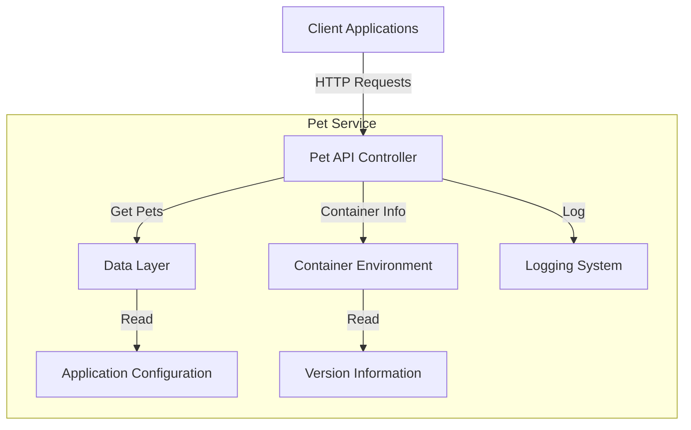
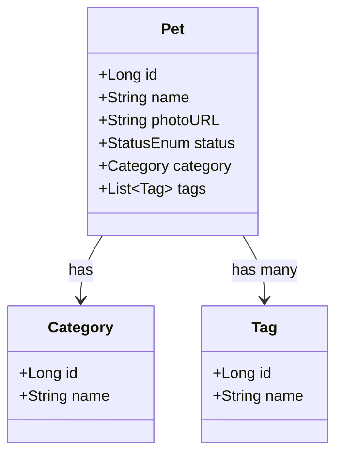

Please review the codebase and create or update the following documentation files while maintaining their existing structure and format.

Required Documentation:
1. README.md
2. ARCHITECTURE.md

Documentation Standards:
- Maintain existing document structure (if applicable)
- Be concise yet informative
- Use professional British English
- Use proper Markdown formatting
- Create or update Mermaid diagrams if applicable

Focus Areas:
1. Technical accuracy
2. Clarity and readability
3. Completeness of information
4. Consistency across documents
5. Current best practices
6. Data model documentation

Key constraints:
- This is an incremental update to existing documentation
- Only update or add documention as necessary 
- Keep a consitent tone and style with existing content
- Use British English

Provide a complete, production-ready update in British English with a professional tone.
```

Workspace: Collecting workspace informationBased on the codebase you've shared, I'll create an updated README.md and a new ARCHITECTURE.md file for your Pet Store Pet Service application.

# README.md

````md
# Pet Store Pet Service

Pet Store Pet Service is a backend Java Spring Boot microservice used in the Azure Pet Store Reference Guide. Its purpose is to deliver pet data to consumers.

## Overview

The service is part of a larger microservices architecture for a pet store application. It specifically handles the pet-related operations, providing data about different types of pets (dogs, cats, fish) and their attributes.

## Technical Details

The project/API scaffolding was generated using Swagger Codegen https://github.com/swagger-api/swagger-codegen and the following Swagger schema https://raw.githubusercontent.com/chtrembl/azure-cloud/main/petstore/petstorepetservice/petstorepetservice.json

For the purposes of this demo, the Pet data is implemented as an in-memory database populated from the application.yml configuration.

## Getting Started

### Generate the API

```bash
java -jar swagger-codegen-cli-2.4.9.jar generate \
-i petstorepetservice.json \
--api-package com.chtrembl.petstore.pet.api \
--model-package com.chtrembl.petstore.pet.model \
--group-id com.chtrembl.petstore.pet \
--artifact-id petstorepetservice \
--artifact-version 0.0.1-SNAPSHOT \
-l spring \
-o petstorepetservice
```

### Build and Run Locally

You can build/deploy it outside of the Azure Pet Store Reference Guide, perhaps on your local development machine using Docker in Linux containers mode.

#### Build the Spring Boot Jar and Docker Image

```bash
docker build -t petstorepetservice .
```

#### Run the Docker Image

```bash
docker run --rm --name petstorepetservice -p 8081:8081 -e PETSTOREPETSERVICE_SERVER_PORT=8081 -d petstorepetservice:latest
```

Note: This example instructs Spring Boot to run on port 8081 and forwards the port to the container accordingly. You are welcome to change this as needed. The chosen port is ultimately what the petstoreapp will point to if/when you choose to run petstoreapp locally as well.

### Optional Environment Variables

Other optional arguments that you can specify for features covered in the Azure Pet Store Reference Guide(s):

Enable Application Insights (empty and disabled by default, uncomment the property in `src/main/resources/application.yml`):

```bash
-e PETSTORESERVICES_AI_INSTRUMENTATION_KEY=<your key here>
```

### Testing Endpoints

#### GET Request for service info (No headers needed)

```
http://localhost:8081/petstorepetservice/v2/pet/info
```

#### GET request for Pets (Accept: application/json and Content-Type: application/json headers needed)

```
http://localhost:8081/petstorepetservice/v2/pet/findByStatus?status=available
```

## Project Structure

- `src/main/java/`: Contains all Java source code
  - `com.chtrembl.petstore.pet.api`: API controllers and interfaces
  - `com.chtrembl.petstore.pet.model`: Data models
  - `io.swagger`: Swagger configuration and utilities
- `src/main/resources/`: Contains configuration files
  - `application.yml`: Main application configuration
  - `version.json`: Version information
  - `logback-spring.xml`: Logging configuration
- `src/test/`: Contains test classes and resources

## Technologies

- Java 8
- Spring Boot 2.0.1
- Swagger/Springfox 2.8.0
- Docker
- Azure Application Insights (optional)
````

# ARCHITECTURE.md

````md
# Pet Store Pet Service Architecture

## Overview

The Pet Store Pet Service is a microservice within the larger Azure Pet Store application architecture. It is designed to provide pet-related data and operations to other services and clients. This document outlines the architecture, components, and data flow of the service.

## Architecture Diagram



## Components

### API Layer

The service exposes RESTful endpoints through Spring Boot controllers:

- `PetApiController`: Implements the `PetApi` interface and handles HTTP requests for pet-related operations
- Primary endpoints:
  - `/pet/info`: Returns service version and container information
  - `/pet/findByStatus`: Returns pets filtered by status
  - Various other endpoints for CRUD operations on pets (many currently return NOT_IMPLEMENTED)

### Data Layer

- `DataPreload`: Loads pet data from the application configuration
- In-memory pet storage: The application maintains pet data in memory, populated from the YAML configuration
- No external database is currently used

### Model Classes

- `Pet`: Core domain model representing a pet with properties like id, name, category, tags, and status
- `Category`: Represents pet categories (e.g., Dog, Cat, Fish)
- `Tag`: Represents tags associated with pets
- `Version`: Contains version information for the service
- `ModelApiResponse`: Standard response format for API operations

### Environment Configuration

- `ContainerEnvironment`: Provides information about the container environment where the service is running
- Reads version information from the `version.json` file at startup

### Swagger/OpenAPI

- Uses Springfox for API documentation and specification
- Configuration in `SwaggerDocumentationConfig`
- Provides a UI for API exploration at `/swagger-ui.html`

## Data Flow

1. Client sends a request to one of the Pet Service endpoints
2. `PetApiController` receives the request and configures thread logging
3. For pet retrieval operations, the controller accesses the preloaded pet data
4. The controller formats the response and returns it to the client

## Deployment

### Docker Deployment

The service can be deployed as a Docker container:
- The `Dockerfile` defines a multi-stage build process
- First stage builds the application with Maven
- Second stage creates a minimal runtime image with the JRE and Application Insights agent

### Kubernetes Deployment

For Kubernetes deployment:
- `aks-petstorepetservice.yml` defines the Deployment and Service resources
- Configures a single replica by default
- Uses ClusterIP for internal service communication

## Logging and Monitoring

- Structured logging using SLF4J and Logback
- MDC context variables for tracking:
  - `containerHostName`: Host information
  - `session_Id`: Client session identifier
- Optional Application Insights integration for telemetry and monitoring

## Configuration

Configuration is primarily managed through:
- `application.yml`: Main application settings and pet data
- Environment variables for deployment-specific settings
- Key configuration points:
  - `PETSTOREPETSERVICE_SERVER_PORT`: Port the service listens on
  - `PETSTORESERVICES_AI_INSTRUMENTATION_KEY`: Application Insights integration

## Data Model

### Pet



- **Pet**: The primary entity representing a pet in the store
  - **id**: Unique identifier
  - **name**: Pet name
  - **category**: Pet category (e.g., Dog, Cat, Fish)
  - **photoURL**: URL to pet image
  - **tags**: List of tags associated with the pet
  - **status**: Availability status (available, pending, sold)

## Future Improvements

Potential improvements to consider:
1. Implement persistence with a database instead of in-memory storage
2. Complete implementation of currently unimplemented API endpoints
3. Add caching for improved performance
4. Enhance error handling and validation
5. Add comprehensive unit and integration tests
````

These documentation files provide a comprehensive overview of the Pet Store Pet Service application, explaining its architecture, components, data flow, and how to build and run it. The ARCHITECTURE.md includes Mermaid diagrams to visualize the architecture and data model.

Similar code found with 1 license type