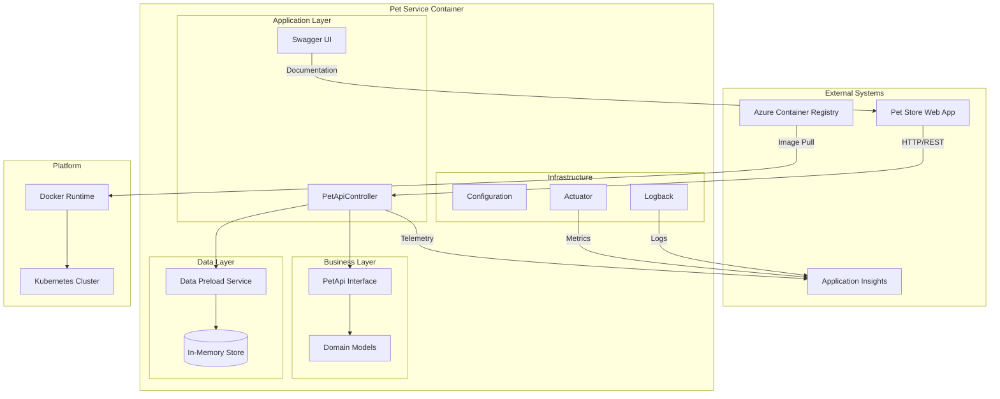
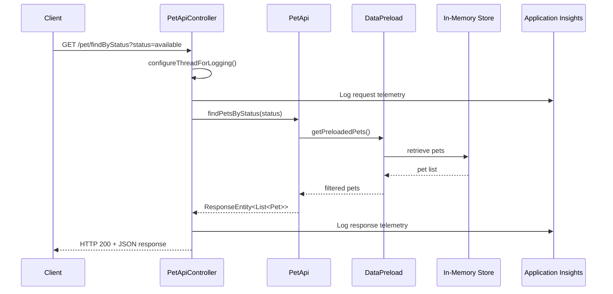
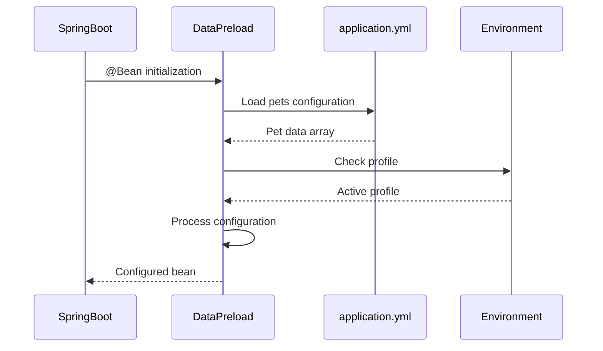
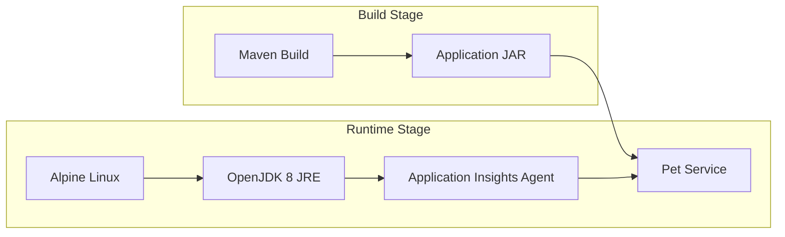

# Pet Store Pet Service - Architecture Documentation

## Overview

The Pet Store Pet Service is a Spring Boot microservice designed following Domain-Driven Design (DDD) principles and microservice architecture patterns. It serves as the authoritative source for pet data within the Azure Pet Store ecosystem.

## Architecture Principles

### Design Patterns

- **API-First Design**: OpenAPI specification drives implementation
- **Dependency Injection**: Spring Framework IoC container
- **Repository Pattern**: Data access abstraction (in-memory implementation)
- **MVC Pattern**: Clear separation of concerns
- **Configuration Management**: Externalised configuration

### Quality Attributes

- **Scalability**: Stateless design enables horizontal scaling
- **Observability**: Comprehensive logging and monitoring
- **Maintainability**: Clean code structure with separation of concerns
- **Testability**: Unit and integration test support
- **Portability**: Container-first deployment strategy

## System Architecture



## Component Architecture

### API Layer

**PetApiController**
- Primary REST controller implementing `PetApi` interface
- Handles HTTP request/response mapping
- Implements cross-cutting concerns (logging, monitoring)
- Delegates business logic to service layer

**PetApi Interface**
- Contract-first API definition
- Generated from OpenAPI specification
- Defines all supported operations and data contracts

### Domain Model

```mermaid
classDiagram
    class Pet {
        +Long id
        +Category category
        +String name
        +String photoURL
        +List~Tag~ tags
        +StatusEnum status
        +getId() Long
        +setId(Long) void
        +getName() String
        +setName(String) void
    }
    
    class Category {
        +Long id
        +String name
        +getId() Long
        +setId(Long) void
        +getName() String
        +setName(String) void
    }
    
    class Tag {
        +Long id
        +String name
        +getId() Long
        +setId(Long) void
        +getName() String
        +setName(String) void
    }
    
    class StatusEnum {
        <<enumeration>>
        AVAILABLE
        PENDING
        SOLD
    }
    
    Pet ||--|| Category : contains
    Pet ||--o{ Tag : has
    Pet ||--|| StatusEnum : status
```

### Data Management

**DataPreload Service**
- Manages in-memory pet catalogue
- Loads configuration from `application.yml`
- Provides data access methods
- Supports different data profiles

**Configuration Strategy**
- YAML-based configuration
- Environment variable overrides
- Profile-specific data sets
- Externalised for different environments

### Infrastructure Components

**Container Environment**
- Manages runtime environment information
- Provides host and version details
- Supports distributed tracing context

**Logging Strategy**
- Structured JSON logging
- Session ID correlation
- Container hostname tracking
- Application Insights integration

## Data Flow

### Request Processing Flow



### Configuration Loading



## Service Interfaces

### REST API Specification

The service implements the following OpenAPI 2.0 specification endpoints:

#### Core Pet Operations
- `POST /pet` - Add new pet
- `PUT /pet` - Update existing pet
- `GET /pet/{petId}` - Retrieve pet by ID
- `DELETE /pet/{petId}` - Remove pet

#### Search Operations
- `GET /pet/findByStatus` - Find pets by availability status
- `GET /pet/findByTags` - Find pets by tag filters

#### Service Operations
- `GET /pet/info` - Service health and version information
- `POST /pet/{petId}/uploadImage` - Upload pet image

### Error Handling

**Standard HTTP Status Codes**
- `200 OK` - Successful operation
- `400 Bad Request` - Invalid input parameters
- `404 Not Found` - Resource not found
- `405 Method Not Allowed` - Invalid HTTP method
- `500 Internal Server Error` - Server-side error

**Error Response Format**
```json
{
  "code": 400,
  "type": "error",
  "message": "Invalid status value"
}
```

## Security Considerations

### Authentication & Authorisation

The service design includes hooks for OAuth2-based security:
- `petstore_auth` scope for write operations
- `api_key` header for read operations
- CORS support for cross-origin requests

### Data Protection

- No sensitive data storage (in-memory only)
- Request/response logging excludes PII
- Environment variable configuration for secrets

## Deployment Architecture

### Container Strategy



### Kubernetes Deployment

**Resource Configuration**
- **Deployment**: Single replica (scalable)
- **Service**: ClusterIP for internal communication
- **Port**: 80 (mapped from container port)
- **Environment**: Configurable via ConfigMaps/Secrets

**Health Checks**
- **Readiness Probe**: Actuator health endpoint
- **Liveness Probe**: HTTP GET on /pet/info
- **Startup Probe**: Application Insights connectivity

## Monitoring and Observability

### Application Insights Integration

**Telemetry Collection**
- HTTP request/response tracking
- Performance counters
- Custom events and metrics
- Exception tracking
- Dependency calls

**Correlation Strategy**
- Session ID propagation via headers
- Container hostname tracking
- Distributed trace correlation

### Logging Architecture

**Structured Logging**
```xml
<pattern>
%clr(%d{yyyy-MM-dd HH:mm:ss.SSS}){faint} %clr(%5p) %clr(${PID:- }){magenta} 
%clr(---){faint} %clr([%15.15t]){faint} %clr(%-40.40logger{39}){cyan} 
%clr(:){faint} application=PetStorePetService session_Id=%X{session_Id} 
containerHostName=%X{containerHostName} | %m%n%wEx
</pattern>
```

**Log Levels**
- `INFO`: Request/response logging
- `DEBUG`: Detailed execution flow
- `ERROR`: Exception and error conditions
- `WARN`: Performance and configuration issues

## Performance Considerations

### Scalability Patterns

- **Stateless Design**: No server-side session state
- **Immutable Data**: In-memory catalogue loaded at startup
- **Connection Pooling**: Tomcat embedded server configuration
- **Caching Strategy**: JVM-level object caching

### Resource Optimisation

- **Memory Usage**: Lightweight Alpine Linux base image
- **Startup Time**: Optimised Spring Boot configuration
- **Network Efficiency**: JSON serialisation with Jackson
- **CPU Usage**: Efficient request processing pipeline

## Extensibility Points

### Adding New Data Sources

1. Implement new data provider in `DataPreload`
2. Configure data source in `application.yml`
3. Add appropriate profile configuration
4. Update health checks and monitoring

### API Extensions

1. Extend `PetApi` interface with new operations
2. Implement in `PetApiController`
3. Update OpenAPI specification
4. Add corresponding tests

### Monitoring Extensions

1. Add custom Application Insights telemetry
2. Extend MDC logging context
3. Configure additional Actuator endpoints
4. Update alerting and dashboard configuration

## Future Considerations

### Potential Enhancements

- **Database Integration**: Replace in-memory store with persistent database
- **Event Sourcing**: Add domain event publishing capabilities
- **Caching Layer**: Implement Redis or similar for distributed caching
- **API Versioning**: Support multiple API versions
- **Circuit Breaker**: Add resilience patterns for external dependencies

### Architectural Evolution

- **CQRS Pattern**: Separate read and write models
- **Event-Driven Architecture**: Integrate with message queues
- **Service Mesh**: Implement Istio for advanced networking
- **GraphQL Support**: Add GraphQL endpoint alongside REST