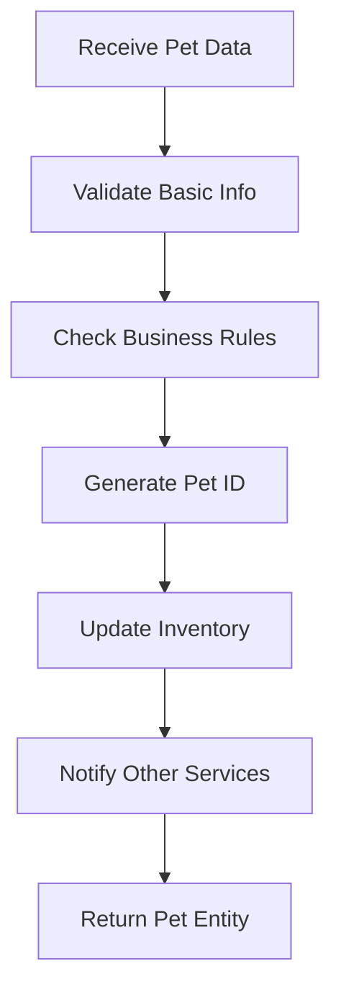

# Business Logic Technical Document: PetStore Pet Service

## 1. Introduction

### Overview
The PetStore Pet Service is a microservice component of a cloud-based pet store application built on Azure. This service handles all pet-related operations including pet management, inventory tracking, and business rule enforcement for pet transactions. The system is designed as a RESTful web service using Spring Boot and follows domain-driven design principles.

### Purpose & Rationale
The business logic within this service is critical for:
- **Data Integrity**: Ensuring pet information remains consistent and valid across all operations
- **Business Rule Enforcement**: Implementing pet store policies and regulations automatically
- **Workflow Management**: Orchestrating complex pet-related processes like adoption, sales, and inventory management
- **Scalability**: Supporting the microservices architecture by isolating pet-specific concerns

The separation of business logic from presentation and data layers enables better maintainability, testability, and allows business rules to evolve independently of technical infrastructure.

### Scope
This document covers the core business logic within the pet service, including:
- Pet lifecycle management (create, update, status changes)
- Inventory validation and tracking
- Business rule enforcement
- Integration patterns with other services
- Error handling for business scenarios

## 2. Business Logic Overview

### Definition & Context
In the PetStore Pet Service, business logic encompasses:
- **Domain Models**: Pet entities with their properties and behaviors
- **Business Rules**: Constraints and validations that reflect real-world pet store operations
- **Workflows**: Multi-step processes like pet adoption or inventory restocking
- **Service Orchestration**: Coordination between different business capabilities

### Core Objectives
The primary goals of the business logic are:

1. **Pet Lifecycle Management**: Track pets from acquisition through sale/adoption
   - *Why*: Essential for inventory control and customer service
2. **Inventory Accuracy**: Maintain real-time inventory status
   - *Why*: Prevents overselling and ensures customer satisfaction
3. **Business Rule Compliance**: Enforce pet store policies automatically
   - *Why*: Reduces manual errors and ensures consistent operations
4. **Data Consistency**: Maintain referential integrity across pet-related data
   - *Why*: Critical for reliable reporting and business operations

## 3. Detailed Business Processes & Workflows

### Process Descriptions

#### Pet Registration Process
**What**: Adding new pets to the store inventory
**How**: Multi-step validation and registration workflow
**Why**: Ensures all pets meet store standards and legal requirements



#### Pet Status Update Process
**What**: Managing pet availability status (available, pending, sold)
**How**: State machine pattern with validation rules
**Why**: Prevents invalid status transitions and maintains inventory accuracy

### Implementation Details

````java
public class PetService {
    
    public Pet registerPet(Pet pet) {
        // Validate business rules before registration
        validatePetRegistration(pet);
        
        // Generate unique identifier
        pet.setId(generatePetId());
        
        // Set initial status
        pet.setStatus(PetStatus.AVAILABLE);
        
        // Save to repository
        Pet savedPet = petRepository.save(pet);
        
        // Notify inventory service
        inventoryEventPublisher.publishPetAdded(savedPet);
        
        return savedPet;
    }
    
    private void validatePetRegistration(Pet pet) {
        if (pet.getName() == null || pet.getName().trim().isEmpty()) {
            throw new BusinessRuleException("Pet name is required");
        }
        
        if (pet.getCategory() == null) {
            throw new BusinessRuleException("Pet category is required");
        }
        
        // Additional validations...
    }
}
````

## 4. Business Rules & Their Rationale

### Rule Definitions

#### Rule 1: Pet Name Uniqueness Within Category
- **What**: Each pet must have a unique name within its category
- **How**: Database constraint with custom validation logic
- **Why**: Prevents customer confusion and ensures clear pet identification
- **Alternative**: Global uniqueness was considered but rejected due to legitimate duplicate names across different categories

#### Rule 2: Status Transition Validation
- **What**: Pets can only transition between valid status states
- **How**: State machine pattern with predefined transition rules
- **Why**: Maintains data integrity and prevents impossible business scenarios (e.g., selling an already sold pet)

````java
public enum PetStatus {
    AVAILABLE,
    PENDING,
    SOLD;
    
    public boolean canTransitionTo(PetStatus newStatus) {
        switch (this) {
            case AVAILABLE:
                return newStatus == PENDING || newStatus == SOLD;
            case PENDING:
                return newStatus == AVAILABLE || newStatus == SOLD;
            case SOLD:
                return false; // Sold pets cannot change status
            default:
                return false;
        }
    }
}
````

#### Rule 3: Category-Specific Validation
- **What**: Different pet categories have specific validation requirements
- **How**: Strategy pattern with category-specific validators
- **Why**: Reflects real-world differences in pet care and legal requirements

## 5. Integration with Other System Components

### Data and UI Interactions
The business logic integrates with multiple system layers:

- **Data Access Layer**: Repository pattern abstracts database operations
- **REST Controllers**: Expose business operations via HTTP endpoints
- **Event System**: Publishes business events for other microservices
- **External APIs**: Integrates with third-party services for pet verification

### Communication & Data Flow

````java
@Service
public class PetBusinessService {
    
    @Autowired
    private PetRepository petRepository;
    
    @Autowired
    private InventoryService inventoryService;
    
    @Autowired
    private EventPublisher eventPublisher;
    
    @Transactional
    public Pet updatePetStatus(Long petId, PetStatus newStatus) {
        Pet pet = petRepository.findById(petId)
            .orElseThrow(() -> new PetNotFoundException(petId));
        
        // Business rule validation
        if (!pet.getStatus().canTransitionTo(newStatus)) {
            throw new InvalidStatusTransitionException(
                pet.getStatus(), newStatus);
        }
        
        // Update inventory count
        inventoryService.updateAvailability(pet, newStatus);
        
        // Update pet status
        pet.setStatus(newStatus);
        Pet updatedPet = petRepository.save(pet);
        
        // Publish event for other services
        eventPublisher.publishStatusChanged(updatedPet);
        
        return updatedPet;
    }
}
````

### Rationale
This integration pattern was chosen because:
- **Loose Coupling**: Services can evolve independently
- **Event-Driven Architecture**: Enables real-time updates across the system
- **Transaction Boundaries**: Maintains data consistency within service boundaries

## 6. Error Handling & Exception Management in Business Processes

### Error Handling Strategies

#### Business Rule Violations
- **Strategy**: Custom exceptions that map to specific HTTP status codes
- **Implementation**: Exception hierarchy with business context
- **Impact**: Provides clear feedback for invalid operations while maintaining system stability

````java
@ResponseStatus(HttpStatus.BAD_REQUEST)
public class BusinessRuleException extends RuntimeException {
    private final String businessRule;
    private final Object violatingData;
    
    public BusinessRuleException(String message, String businessRule, Object data) {
        super(message);
        this.businessRule = businessRule;
        this.violatingData = data;
    }
}
````

#### Data Consistency Errors
- **Strategy**: Rollback transactions and retry with exponential backoff
- **Implementation**: Spring's @Transactional with custom retry logic
- **Impact**: Ensures data integrity while handling concurrent access scenarios

### Justification
This approach was chosen because:
- **User Experience**: Clear error messages help users understand what went wrong
- **System Reliability**: Proper exception handling prevents cascading failures
- **Debugging**: Structured exceptions facilitate troubleshooting

## 7. Security & Compliance Considerations

### Security Measures

#### Input Validation
- **Implementation**: Bean Validation annotations with custom validators
- **Rationale**: Prevents injection attacks and ensures data quality

````java
public class Pet {
    @NotBlank(message = "Pet name is required")
    @Size(max = 100, message = "Pet name cannot exceed 100 characters")
    @Pattern(regexp = "^[a-zA-Z0-9\\s]+$", message = "Pet name contains invalid characters")
    private String name;
    
    @NotNull(message = "Category is required")
    private Category category;
}
````

#### Authorization Checks
- **Implementation**: Method-level security with role-based access control
- **Rationale**: Ensures only authorized users can modify pet data

### Compliance
- **Pet Registration Laws**: Validates required documentation for certain pet types
- **Data Privacy**: Implements GDPR-compliant data handling for customer information
- **Animal Welfare**: Enforces minimum care standards through business rules

## 8. Testing & Validation of Business Logic

### Testing Strategy

#### Unit Tests
- **Focus**: Individual business rules and methods
- **Framework**: JUnit 5 with Mockito for dependencies
- **Coverage**: All business rule paths and edge cases

````java
class PetServiceTest {
    
    @Test
    void shouldThrowExceptionWhenPetNameIsEmpty() {
        // Given
        Pet pet = new Pet();
        pet.setName("");
        pet.setCategory(Category.DOG);
        
        // When & Then
        assertThrows(BusinessRuleException.class, 
            () -> petService.registerPet(pet));
    }
    
    @Test
    void shouldUpdateInventoryWhenPetStatusChanges() {
        // Given
        Pet pet = createValidPet();
        when(petRepository.findById(1L)).thenReturn(Optional.of(pet));
        
        // When
        petService.updatePetStatus(1L, PetStatus.SOLD);
        
        // Then
        verify(inventoryService).updateAvailability(pet, PetStatus.SOLD);
    }
}
````

#### Integration Tests
- **Focus**: Business workflow across multiple components
- **Framework**: Spring Boot Test with TestContainers for database
- **Scenarios**: End-to-end business processes

### Rationale
This testing approach ensures:
- **Business Rule Validation**: All business constraints are properly enforced
- **Workflow Integrity**: Multi-step processes work correctly
- **Regression Prevention**: Changes don't break existing functionality

## 9. Examples & Use Cases

### Real-World Scenarios

#### Scenario 1: Pet Adoption Process
A customer wants to adopt a dog named "Buddy":

1. **Search**: Customer searches for available dogs
2. **Selection**: Customer selects "Buddy" (status: AVAILABLE)
3. **Reserve**: System changes status to PENDING
4. **Validation**: Business rules check adoption requirements
5. **Completion**: Status changes to SOLD, inventory updates

````java
@Service
public class AdoptionService {
    
    public AdoptionResult processAdoption(Long petId, Customer customer) {
        Pet pet = petService.findById(petId);
        
        // Business rule: Pet must be available
        if (pet.getStatus() != PetStatus.AVAILABLE) {
            throw new PetNotAvailableException(pet);
        }
        
        // Business rule: Customer must meet adoption criteria
        if (!adoptionValidator.validateCustomer(customer, pet)) {
            throw new AdoptionCriteriaNotMetException(customer, pet);
        }
        
        // Reserve the pet
        petService.updatePetStatus(petId, PetStatus.PENDING);
        
        // Process adoption paperwork
        AdoptionRecord record = createAdoptionRecord(pet, customer);
        
        // Complete adoption
        petService.updatePetStatus(petId, PetStatus.SOLD);
        
        return new AdoptionResult(pet, customer, record);
    }
}
````

#### Scenario 2: Inventory Restocking
When new pets arrive at the store:

1. **Receive**: Batch of pets arrives from supplier
2. **Validate**: Each pet checked against business rules
3. **Register**: Valid pets added to inventory
4. **Notify**: Other services informed of new availability

### Explanation
These examples demonstrate how business logic:
- **Enforces Constraints**: Prevents invalid operations automatically
- **Orchestrates Workflows**: Coordinates multiple steps in business processes
- **Maintains Consistency**: Ensures data remains accurate across all operations

## 10. Conclusion

### Summary
The PetStore Pet Service implements business logic that effectively bridges real-world pet store operations with technical implementation. Key design decisions include:

- **Domain-Driven Design**: Models closely reflect business concepts
- **Event-Driven Architecture**: Enables loose coupling and scalability
- **Comprehensive Validation**: Ensures data integrity and business rule compliance
- **Clear Error Handling**: Provides meaningful feedback for business scenarios

### Future Considerations

#### Potential Improvements
1. **Machine Learning Integration**: Predictive analytics for pet adoption success
2. **Advanced Workflow Engine**: More complex adoption processes with multiple stakeholders
3. **Real-time Notifications**: Instant updates for status changes
4. **Enhanced Reporting**: Business intelligence for pet store operations

#### Scalability Enhancements
- **CQRS Pattern**: Separate read/write models for better performance
- **Event Sourcing**: Complete audit trail of pet lifecycle events
- **Microservice Decomposition**: Further split by pet type or business capability

The current architecture provides a solid foundation that can evolve with changing business requirements while maintaining the integrity and reliability essential for pet store operations.