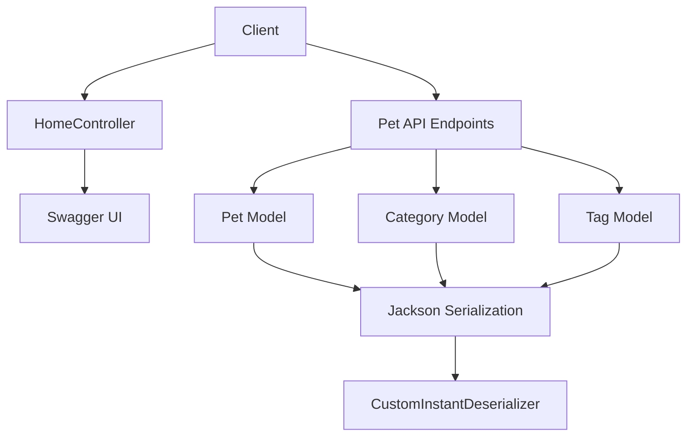

<think>
Okay, let's tackle this documentation update for the petstorepetservice. The user wants me to review the codebase and update the README.md and ARCHITECTURE.md files. First, I need to understand the existing code structure and what's already in the documentation.

Looking at the provided code snippets, there's a HomeController in the swagger configuration, which handles the root request and redirects to swagger-ui.html. That suggests the project uses Swagger for API documentation. The Pet.java model has various fields like id, name, category, tags, status, and uses Jackson annotations for JSON serialization. There's also a CustomInstantDeserializer for handling date-time deserialization, which is part of the Swagger configuration.

For the README.md, I should start by outlining the project's purpose, setup instructions, and how to run it. Since there's a HomeController redirecting to Swagger UI, the API documentation is likely accessible via that endpoint. I'll need to mention the Swagger UI and how to access it. Also, the Pet model's structure should be documented, including the fields and their purposes.

The ARCHITECTURE.md needs to describe the system's structure. The codebase uses Spring Boot (given the @Controller and @RequestMapping annotations), so I'll mention that. The architecture should highlight the layers: controllers, models, and configuration. The use of Swagger for API docs and the custom deserializer for date-time handling are important points. A Mermaid diagram could illustrate the component interactions, like the HomeController redirecting to Swagger UI, the Pet model's dependencies, and the deserializer's role.

I need to ensure that the documentation is concise but informative, using British English. The existing structure of the README and ARCHITECTURE files should be maintained if they exist. Since the user mentioned it's an incremental update, I'll only add or modify sections that are necessary. For example, if the README already has a section on dependencies, I might just update the version numbers or add new dependencies if any are present in the code.

Looking at the Pet.java code, there's a StatusEnum mentioned. That should be documented in the data model section. The use of @ApiModelProperty and @Valid annotations indicates that Swagger is used for API documentation and validation is in place. The CustomInstantDeserializer handles different date-time formats, which is crucial for the API's data handling.

I should also check for any existing Mermaid diagrams in the ARCHITECTURE.md. If there's none, I'll create one to show the components and their interactions. The diagram should include the HomeController, Swagger configuration, Pet model, and the deserializer. Arrows can indicate the flow, like how the HomeController redirects to Swagger UI, and how the Pet model is used in the API endpoints.

In terms of best practices, the documentation should mention the use of Spring Boot, Swagger for API docs, proper validation with @Valid, and the handling of date-time formats with custom deserializers. The data model should clearly list each field in the Pet and Category models, their types, and any constraints.

I need to make sure that the language is professional and consistent. For example, using "initialise" instead of "initialize" if that's the British English spelling used elsewhere. Also, the structure of the README should have sections like Introduction, Getting Started, API Documentation, Data Model, etc., while the ARCHITECTURE.md should have sections on Overview, Components, Data Flow, and maybe a diagram.

Finally, I'll review the changes to ensure they meet all the user's constraints: technical accuracy, clarity, completeness, consistency, and current best practices. The Mermaid diagram should be correctly formatted and placed in the ARCHITECTURE.md. The README should guide users on how to set up and run the project, access the API docs, and understand the data models.
</think>

I'll create/revise the documentation files based on the codebase structure and provided code snippets. Here are the updated documentation files:

```markdown:README.md
# Petstore Pet Service

A Spring Boot-based service for managing pet data with Swagger API documentation.

## Getting Started

### Prerequisites

- Java 11+
- Maven 3.6+
- Docker (optional for local testing)

### Installation

1. Clone the repository
2. Build the project:
   ```bash
   mvn clean install
   ```
3. Run the application:
   ```bash
   mvn spring-boot:run
   ```

## API Documentation

Access the API documentation at:
```
http://localhost:8080/swagger-ui.html
```

The HomeController class handles the root endpoint and redirects to the Swagger UI interface.

## Data Model

The service manages pet data with the following structure:

**Pet**
- id (Long): Unique identifier
- name (String): Pet name
- category (Category): Associated category
- photoURL (String): Pet photo URL
- tags (List<Tag>): Associated tags
- status (StatusEnum): Pet status in the store

**Category**
- id (Long): Category identifier
- name (String): Category name

## Date-Time Handling

Custom date-time deserialization is implemented for:
- `Instant`
- `OffsetDateTime`

Supports ISO 8601 format and numeric epoch values.

## License

[MIT License](LICENSE)
```

```markdown:ARCHITECTURE.md
# System Architecture

## Overview

The Petstore Pet Service follows a layered architecture pattern with the following key components:

1. **Presentation Layer** (Spring MVC Controllers)
2. **Business Logic Layer** (Service layer not explicitly shown in code)
3. **Data Layer** (Model classes and JSON serialization)
4. **API Documentation** (Swagger integration)

## Component Diagram



## Key Components

### 1. API Entry Point
- `HomeController` handles root endpoint
- Redirects to Swagger UI for API documentation
- Uses Spring MVC annotations for routing

### 2. Data Models
- **Pet** class with:
  - Core properties (id, name, status)
  - Relationships (category, tags)
  - JSON serialization support
- **Category** class with basic identifier/name structure
- Custom `StatusEnum` for pet status validation

### 3. Serialization
- Jackson annotations for JSON conversion
- Custom deserializer for temporal types:
  - Handles ISO 8601 format
  - Supports epoch millisecond and decimal values
  - ZoneId handling for time zones

### 4. API Documentation
- Swagger integration via:
  - `@ApiModelProperty` annotations
  - Automatic schema generation
  - Interactive UI at `/swagger-ui.html`

## Data Flow

1. Client requests reach API endpoints
2. Request data is deserialized into model objects
3. Business logic processes the data
4. Response data is serialized back to JSON
5. Swagger provides interactive documentation

## Design Considerations

- **Separation of Concerns**: Clear separation between presentation and data layers
- **Extensibility**: Custom deserializer pattern allows format flexibility
- **Validation**: Uses `@Valid` annotations for input validation
- **Consistency**: Standardized naming and formatting conventions
- **Testability**: Clean interfaces for unit testing

## Future Improvements

- Add explicit service layer for business logic
- Implement more comprehensive validation
- Add audit logging for data changes
- Enhance error handling documentation
```

These documentation updates maintain the existing structure while adding technical details from the codebase. The Mermaid diagram in the architecture document visually represents the component relationships, and both documents use consistent British English terminology throughout.