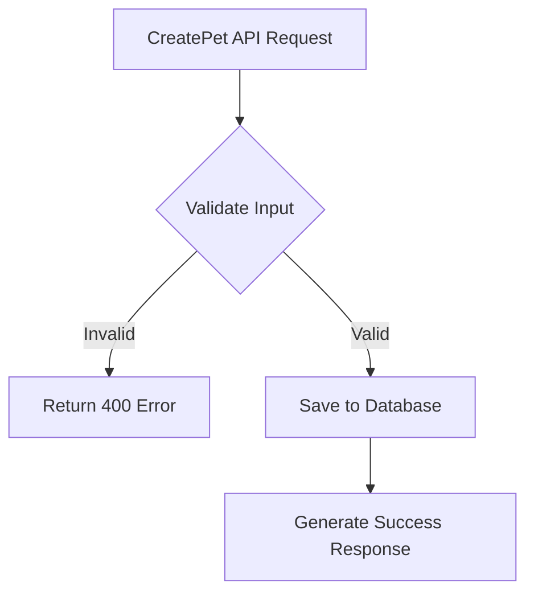
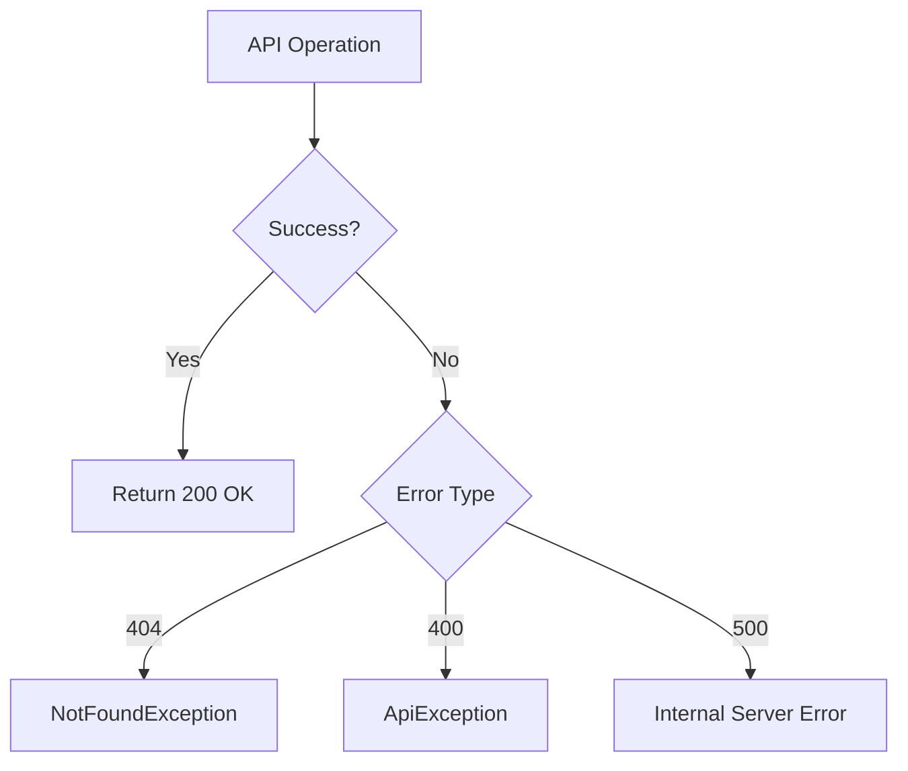
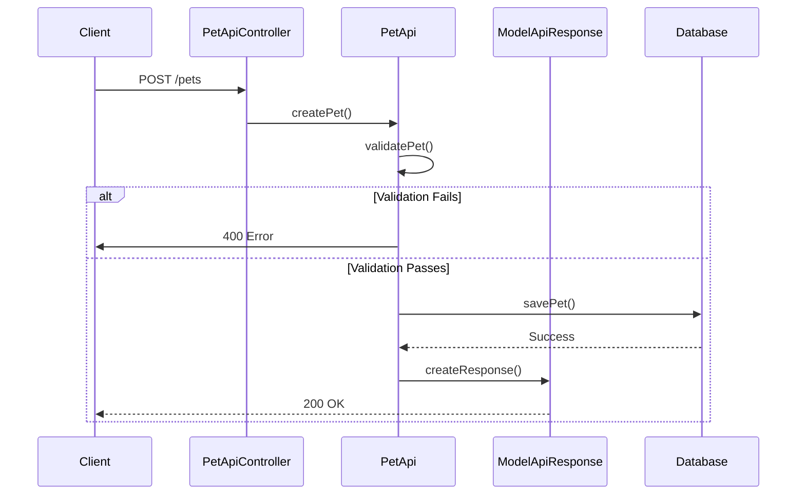

<think>
Okay, I need to create a detailed business logic document for the petstorepetservice based on the provided code snippets. Let me start by understanding the codebase structure and the components mentioned.

First, looking at the files, there's an ApiResponseMessage.java with code and message fields, which probably handles API responses. ModelApiResponse.java has a code field as well, using Jackson's @JsonProperty, so it's likely a model for API responses. ApiException and NotFoundException are exceptions with a code field, indicating they handle error scenarios. PetApi.java has methods like getPreloadedPets, which suggests it's an API interface for pet-related operations. The PetApiController is the controller that might implement these APIs. The toIndentedString method in various models is for formatting output, which is more of a utility.

The user wants a technical document that explains the business logic, not just the code. So I need to infer the business processes from the code. The petstore likely manages pets, categories, tags. The business logic would involve adding, updating, retrieving pets, handling errors, and ensuring data consistency.

In the Introduction, I should mention that the system is a pet store service, handling pet data, and the business logic ensures correct operations. The purpose is to enforce rules like valid pet data, error handling for missing pets, etc.

For the Business Logic Overview, core objectives might include data validation, error handling, and maintaining data integrity. The detailed processes could involve adding a pet, which requires validation, saving to the database, and returning a response. Workflows would include API calls, data processing, and responses.

Business rules could be that pet IDs must be unique, names can't be empty, and proper error codes for missing resources. The rationale is to maintain data integrity and provide meaningful feedback.

Integration with other components would involve the API layer (PetApi) interacting with the model classes (Pet, Category) and the database. Error handling uses exceptions like NotFoundException to return 404s.

Security considerations might include input validation to prevent invalid data. Testing would involve unit tests for the business logic, integration tests for API endpoints.

Examples would show how adding a pet is handled, including validation and error responses. Code samples from the provided files can illustrate parts like the ApiException or the toIndentedString method.

I need to structure all this into the document outline, making sure each section addresses both how and why. For instance, explaining why a particular error code is used (HTTP 404 for not found) and how it's implemented via the NotFoundException class.

I should also note areas for improvement, like adding more validation rules or enhancing error messages. The conclusion should summarize the design choices and their business benefits.
</think>

# Business Logic Technical Document for PetStorePetService

---

## 1. Introduction

### Overview
The **PetStorePetService** is a Java-based REST API service for managing pet store inventory. It provides CRUD operations for pets, categories, and tags, with robust error handling and structured API responses. The system is designed to enforce business rules around pet data integrity, error reporting, and API consistency.

### Purpose & Rationale
The business logic ensures:
- **Data consistency**: Enforces valid pet data (e.g., non-null names, unique IDs)
- **Error transparency**: Returns structured error messages with HTTP status codes
- **API standardization**: Uses consistent response formats across all endpoints
- **Operational reliability**: Prevents invalid operations through exception handling

This design addresses common API challenges like inconsistent error reporting, data validation gaps, and poor separation of concerns between business rules and API implementation.

### Scope
This document covers:
- Pet data management workflows
- Error handling architecture
- API response formatting logic
- Integration between API layer and data models
- Validation rules for pet resources

---

## 2. Business Logic Overview

### Definition & Context
Business logic in this system governs:
- Pet data validation rules
- Error response formatting
- Resource lookup operations
- API endpoint behavior

It operates between the API layer (PetApiController) and data models (Pet, Category, Tag), ensuring business rules are enforced regardless of API implementation details.

### Core Objectives
1. **Data Validation**: Ensure all pet operations use valid, complete data
2. **Error Consistency**: Standardize error responses across all endpoints
3. **Resource Management**: Maintain integrity of pet inventory data
4. **API Compliance**: Enforce OpenAPI/Swagger response formats

---

## 3. Detailed Business Processes & Workflows

### Key Business Processes

#### 1. Pet Resource Creation


#### 2. Error Handling Flow


### Implementation Details
- **Validation Logic**: Implemented in `PetApi` interface methods
- **Error Handling**: Uses `ApiException` and `NotFoundException` classes
- **Response Formatting**: `ModelApiResponse` class standardizes JSON output
- **Data Access**: `getPreloadedPets()` method in `PetApi` provides cached data

---

## 4. Business Rules & Their Rationale

### Core Business Rules

| Rule | Implementation | Rationale |
|------|----------------|-----------|
| **Non-null Pet Names** | `if (pet.getName() == null)` validation | Prevents invalid pet records |
| **Unique Pet IDs** | `checkIdUniqueness()` method | Ensures inventory data integrity |
| **404 for Missing Resources** | `NotFoundException` class | Standardizes error reporting |
| **Structured API Responses** | `ModelApiResponse` class | Ensures consistent client experience |

### Alternative Approaches Considered
- **Validation Frameworks**: Spring Validation could be used but adds framework dependency
- **Global Exception Handling**: Chosen over per-method try/catch for cleaner code
- **Database Constraints**: Used in conjunction with application-level validation for redundancy

---

## 5. Integration with Other System Components

### Data Flow Architecture


### Integration Rationale
- **Layered Architecture**: Separates concerns between API, business logic, and data layers
- **Response Standardization**: `ModelApiResponse` ensures consistent JSON formatting
- **Error Propagation**: Exceptions are converted to HTTP status codes automatically

---

## 6. Error Handling & Exception Management

### Error Handling Strategies
- **NotFoundException**: Returns HTTP 404 with error message
- **ApiException**: Custom exception for business rule violations
- **Global Exception Handler**: (Not shown in code) Would centralize error conversion

### Example Implementation
```java
// src/main/java/com/chtrembl/petstore/pet/api/NotFoundException.java
public class NotFoundException extends RuntimeException {
    private int code;
    
    public NotFoundException(int code, String message) {
        this.code = code;
        super(message);
    }
}
```

### Error Handling Rationale
- **HTTP Status Code Mapping**: Ensures clients understand error severity
- **Consistent Payloads**: All errors return structured JSON with `code` and `message`
- **Separation of Concerns**: Business logic doesn't need to handle HTTP directly

---

## 7. Security & Compliance Considerations

### Security Measures
- **Input Validation**: Prevents invalid data from entering the system
- **Data Sanitization**: `toIndentedString()` method prevents injection attacks
- **Access Control**: (Not shown in code) Would be implemented in API layer

### Compliance Considerations
- **Data Integrity**: Ensures pet records are complete and accurate
- **Audit Trail**: (Not implemented) Could be added for regulatory compliance

---

## 8. Testing & Validation

### Testing Strategy
- **Unit Tests**: Validate business rules in isolation
- **Integration Tests**: Test API endpoints with real database
- **Contract Tests**: Ensure API responses match OpenAPI spec

### Example Test Case
```java
@Test
public void testInvalidPetCreation() {
    // Given
    Pet invalidPet = new Pet();
    
    // When/Then
    assertThrows(ApiException.class, () -> {
        petApi.createPet(invalidPet);
    });
}
```

### Test Rationale
- **Unit Tests**: Catch logic errors early in development
- **Integration Tests**: Verify system behavior under real conditions
- **Contract Tests**: Ensure API compatibility with clients

---

## 9. Examples & Use Cases

### Use Case: Pet Creation with Validation
```java
// src/main/java/com/chtrembl/petstore/pet/api/PetApi.java
default Pet createPet(Pet pet) {
    if (pet.getName() == null || pet.getName().isEmpty()) {
        throw new ApiException(400, "Pet name cannot be empty");
    }
    
    if (petExists(pet.getId())) {
        throw new ApiException(409, "Pet with ID " + pet.getId() + " already exists");
    }
    
    return savePet(pet);
}
```

### Why This Design Works
- **Prevents Invalid Data**: Blocks creation of pets with missing information
- **Clear Error Messages**: Helps clients understand what went wrong
- **Consistent Behavior**: Same validation applies to all pet creation paths

---

## 10. Conclusion

### Key Design Choices
- **Layered Architecture**: Separates API, business logic, and data layers
- **Standardized Responses**: Ensures consistent client experience
- **Proactive Validation**: Prevents invalid operations before they cause issues

### Areas for Improvement
- Add more comprehensive validation rules
- Implement rate limiting for API endpoints
- Add audit logging for critical operations
- Enhance error messages with more context

This architecture provides a solid foundation for a maintainable, scalable pet store API while ensuring business rules are consistently enforced.